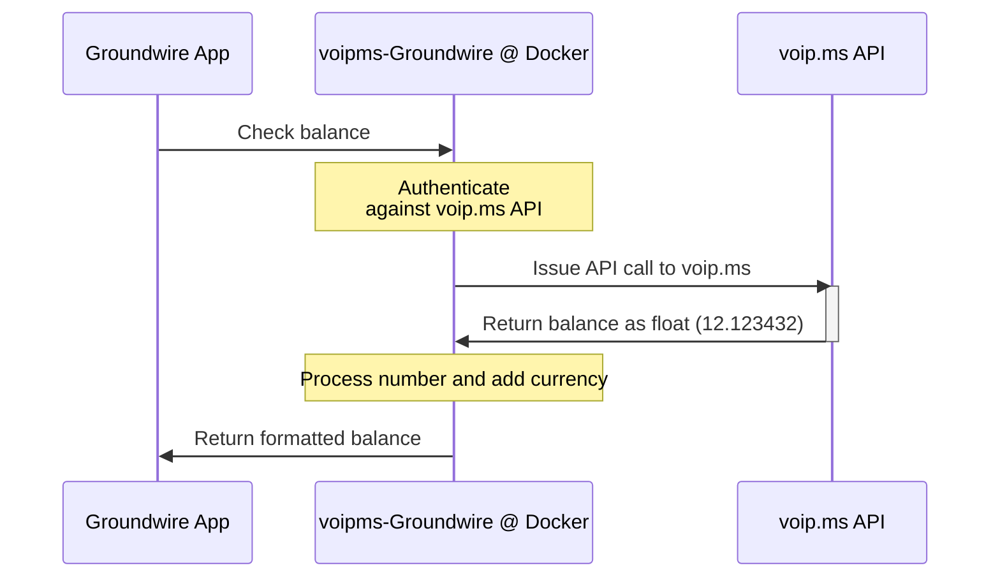

## ‼️ Archived and updated to [Cloudflare Worker Git repo](https://github.com/acheremisov/voipms-groudwire-cloudflare-worker)

# Balance checker for voip.ms at Acrobits Groundwire iOS app

Docker container to expose [voip.ms](voip.ms) API in [Groundwire format](https://doc.acrobits.net/api/client/balance_checker.html). Build it as a side project to practice knowledge in Github, Node, Express, Docker, Trivy Docker scan, etc. If you see any opportunity for optimization - pull requests are welcome.



# Deployment

## voip.ms

1. Go to [voip.ms API page](https://voip.ms/m/api.php) and configure API password.
2. Enable API by clicking `Enable/Disable API`. Make sure that it shows `Enabled`
3. Configure IP address of the host where your Docker container will be deployed. If you don't have static IP you can configure `0.0.0.0` to allow access from all IPs, **but it presents serious security risk**.

## Docker

Deploy docker container. <br>
Enviroment variables `USERNAME` and `PASSWORD` are required. <br>
`USERNAME` is your voip.ms login email and `PASSWORD` is API password that you configured at previous step. <br>
`CURRENCY` is currency name that you will see in iOS app. Cosmetic and doesn't impact anything. Variable is optional and will be `CAD` by default.

## Groundwire iOS App

Configure in Groundwire settings

`Settings -> Select voip.ms number -> Advanced Settings -> Web Services -> Balance Checker`

_Note: Docker container is available via port 3000_ <br>
URL: `URL of your docker container :3000` <br> (for example via IP http://52.12.23.1:3000 or URL http://app.example:com:3000) <br>
Method: `Get` <br>

## Docker Compose

```
  groundwire:
    image: ghcr.io/acheremisov/voipms-groundwire:v.1
    container_name: groundwire
    restart: unless-stopped
    ports:
      - "3000:3000"
    environment:
      - USERNAME=andrew@mail.org    # required, voip.ms login email
      - PASSWORD=MyApiPassword123   # required, voip.ms API password
      - CURRENCY=CAD                # optional, CAD by default

```

# Groundwire screenshot


